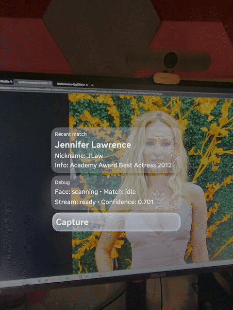

# FriendFinder

FriendFinder is an iOS app that connects to Meta AI glasses through the Meta Wearables Device Access Toolkit and performs on-device face matching against a friend library you build in the app.

After connecting your glasses, you can manage friend profiles, add training photos, and run live recognition while streaming.

## Demo
Rather than dox my family or friends I loaded up someone everyone will know. The Display Glasses don't allow recording while streaming video the phone at the same time so this demo shows a match already having occurred.

## What The App Does

- Connects to Meta AI glasses using the DAT SDK registration and permission flow
- Starts a camera stream session from connected glasses
- Lets you create and manage a friend list (name, nickname, and notes)
- Lets you attach one or more training photos per friend
- Builds friend embeddings and matches live faces against your saved friends
- Shows recognition status and latest match information during streaming
- Syncs friends data with iCloud Drive (including deletion-safe tombstones)
- Supports manual JSON/package import and JSON export from the Friends screen
- Supports firmware and glasses DAT app update handoff when required

## Prerequisites

- iOS 17.0+
- Xcode 14.0+
- Swift 5.0+
- Meta Wearables Device Access Toolkit (included as a dependency)
- A Meta AI glasses device for testing (optional for development)

## Building the app

### Using Xcode

1. Clone this repository
1. Open the project in Xcode
1. Select your target device
1. Click the "Build" button or press `Cmd+B` to build the project
1. To run the app, click the "Run" button (▶️) or press `Cmd+R`

## Running the app

1. Turn 'Developer Mode' on in the Meta AI app.
1. Launch the app.
1. Tap "Connect my glasses" and complete registration.
1. After registration, start a stream session from the home screen.
1. Open the Friends screen to add people you want to recognize.
1. For each friend, add clear training photos and save.
1. Return to streaming and start recognition to see live matches.
1. Use the in-app controls to manage connection state and recognition.
1. If a firmware update is required, tap "Update firmware" from the connection screen.
1. If session start reports that the app on the glasses is outdated, tap "Update app on glasses" from the connection screen.

## Helper Scripts

- tools/facebook_friend_exporter/facebook_friend_exporter.py: Opens Facebook in Playwright, scrapes friend profile photos, and generates a FriendFinder-importable friends-package.zip.

## Friends Import, Export, and iCloud Sync

FriendFinder now supports two transfer paths:

- Automatic iCloud Drive sync (recommended)
- Manual file import/export from the Friends screen

### Automatic iCloud sync (Mac + iPhone)

1. Sign in with the same Apple ID on your iPhone and Mac.
1. Enable iCloud Drive on both devices.
1. Open FriendFinder on iPhone and go to Friends.
1. The app syncs to an iCloud folder automatically and also supports "Sync with iCloud Now".
1. On Mac, open Finder > iCloud Drive and locate the FriendFinder app container data.
1. Changes written by the app (friends package + images) will propagate to the phone app.

Important:

- iCloud capabilities require a paid Apple Developer Program team profile for device signing.
- If you are using a Personal Team profile, the app will still run but iCloud sync will stay unavailable and local/manual transfer flows still work.

Conflict policy:

- Merge key: friend id
- Winner: newest `updatedAt` timestamp
- Deletions are persisted as tombstones so older remote payloads do not resurrect deleted friends

### Manual import/export from Friends screen

Open Friends and use the sync icon in the top-right toolbar:

- Import JSON or Package: imports `friends-package.zip`, `friends.json`, or a package folder containing `friends-package.json` and `images/`
- Export ZIP (JSON + images): exports a single zip archive for transfer
- Export JSON only: exports just the current friend list JSON
- Sync with iCloud Now: triggers an immediate iCloud sync

Notes:

- JSON-only import/export moves metadata and embeddings. Image files are transferred when using ZIP/package import/export or iCloud package sync.
- Import results report counts for imported/merged friends and missing images.
- The Friends screen shows sync status: iCloud availability, last sync time, and latest sync error.

## Support

If you found this project helpful, you can support me:

## Troubleshooting

For issues related to the Meta Wearables Device Access Toolkit, please refer to the [developer documentation](https://wearables.developer.meta.com/docs/develop/) or visit our [discussions forum](https://github.com/facebook/meta-wearables-dat-ios/discussions)

## License

This sample is distributed under the MIT License.

Face recognition in this sample uses FaceNet assets/training data lineage from:
https://github.com/davidsandberg/facenet

That upstream project is MIT-licensed, and this sample's FaceNet-related assets are used under MIT terms.
See LICENSE.md for the full license text.

## Attribution

- FaceNet project: https://github.com/davidsandberg/facenet
